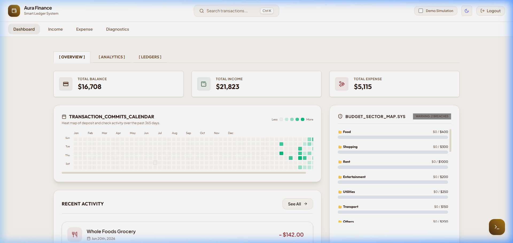
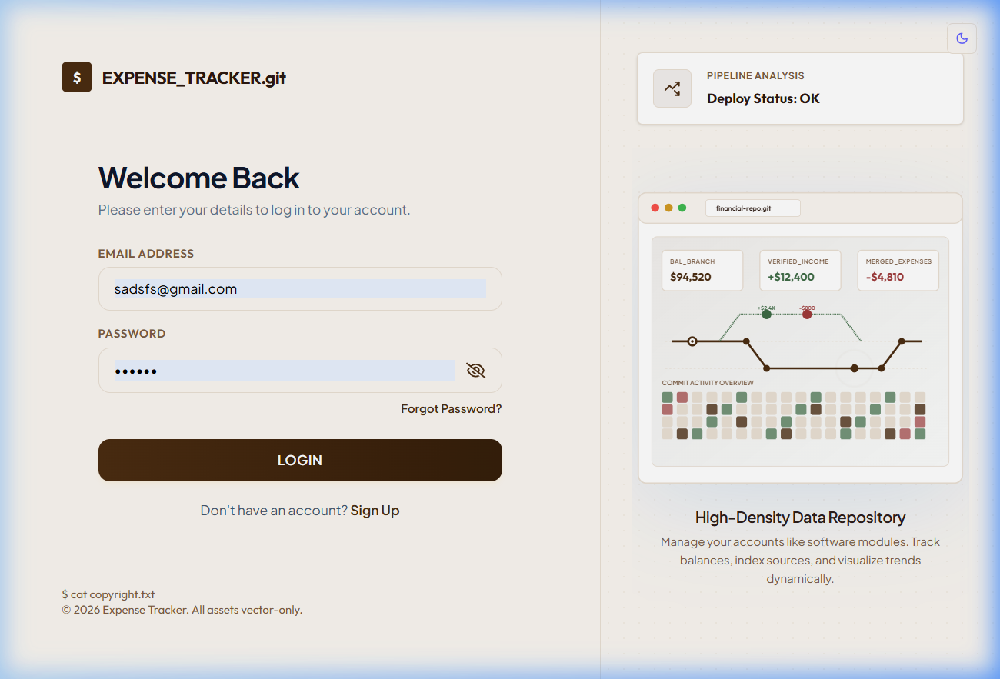
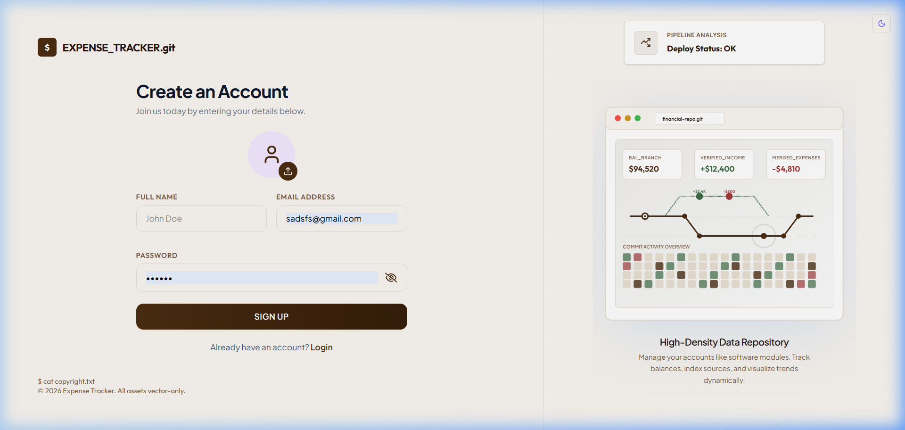
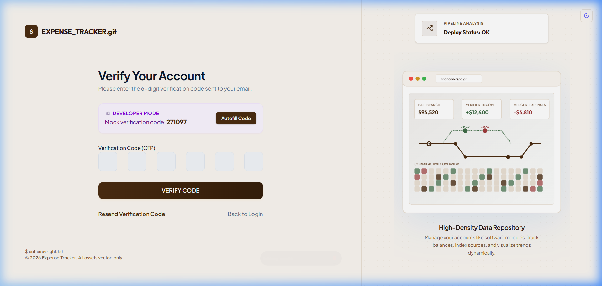

# Expense Tracker

A full-stack web application for tracking and visualizing personal finances. It allows users to log income and expenses, monitor budgets, and view reports via charts. It also features a command palette, light/dark theme toggle, a custom developer console, audio alerts, and a contribution grid.

## Screenshots

### Dashboard


### Authentication Flows
* **Login**: 
* **Sign Up**: 
* **OTP Verification**: 

## Features

* **Financial Visualization**: Dashboard with bar, line, and pie charts using Recharts.
* **Command Palette**: Quickly search and execute commands by pressing `Ctrl + K`.
* **Contribution Calendar**: A grid showing transaction activity over time, similar to GitHub contribution maps.
* **Theme Customization**: Dark and light modes using React Context API.
* **Diagnostics Panel**: Views app statistics, database stats, API response times, and memory logs.
* **Terminal Shell**: A custom command-line interface in the browser to run diagnostics and debug.
* **Audio Cues**: Feedback sounds triggered by operations like login, successful transactions, or errors.
* **Secure Authentication**: Uses JSON Web Tokens (JWT) for authentication, with password recovery and OTP verification flows.

## Tech Stack

### Frontend
* React 19 (Vite)
* Tailwind CSS v4
* React Router DOM v7
* Recharts for data visualization
* React Icons & React Hot Toast

### Backend
* Node.js & Express.js
* MongoDB with Mongoose
* JWT (JsonWebToken) & bcryptjs for passwords

## Directory Structure

```text
Expense-Tracker/
├── Backend/
│   ├── config/             # Database connection setup
│   ├── controller/         # Auth, expense, income, and dashboard logic
│   ├── middleware/         # Authentication middleware
│   ├── models/             # User, Income, and Expense database schemas
│   ├── routes/             # Express API endpoints
│   └── server.js           # Server entry point
├── Frontend/
│   ├── public/             # Static files
│   ├── src/
│   │   ├── components/     # UI components (charts, command palette, drawer, console, etc.)
│   │   ├── context/        # Global states (Theme and User context)
│   │   ├── hooks/          # Custom authentication hooks
│   │   ├── pages/          # Application views (Dashboard, Auth pages)
│   │   ├── utils/          # API path configs, helper functions, and sound utilities
│   │   └── App.jsx         # App router and main wrapper
│   └── vite.config.js      # Build configurations
└── screenshots/            # UI screenshots
```

## Setup and Installation

### Backend Setup

1. Navigate to the backend directory:
   ```bash
   cd Backend
   ```
2. Install dependencies:
   ```bash
   npm install
   ```
3. Create a `.env` file in the `Backend` directory:
   ```env
   PORT=5000
   MONGO_URI=your_mongodb_connection_uri
   JWT_SECRET=your_jwt_secret_key
   CLIENT_URL=http://localhost:5173
   ```
4. Start the backend:
   ```bash
   npm start
   ```

### Frontend Setup

1. Navigate to the frontend directory:
   ```bash
   cd ../Frontend
   ```
2. Install dependencies:
   ```bash
   npm install
   ```
3. Create a `.env` file in the `Frontend` directory:
   ```env
   VITE_API_URL=http://localhost:5000/api/v1
   ```
4. Start the development server:
   ```bash
   npm run dev
   ```
5. Open your browser and navigate to `http://localhost:5173`.
